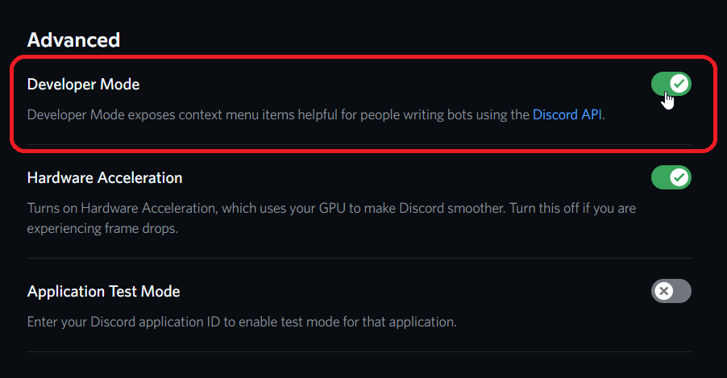
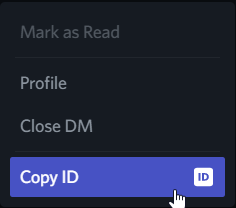

<h1 align="center">
  <br>
  <a href="https://github.com/staciax/ValorantStoreChecker-discord-bot"></a>
  <br>
  발로봇 - 한국인들의 발로란트 봇
  <br>
</h1>

<h4 align="center">상점, 야시장, 스킨 알림등을 한번에!</h4>

<p align="center">
  <a href="https://github.com/teamdoubleeight/Valobot">
     
  </a>
  <a href="https://github.com/Rapptz/discord.py/">
     
 <a href="https://github.com/teamdoubleeight/Valobot/blob/main/LICENSE">
     

</p>

<p align="center">
  <a href="#about">정보</a>
  •
  <a href="#installation">설치하기</a>
  •
  <a href="#usage">사용하기</a>
  •
  <a href="#disclaimer">Disclaimer</a>
</p>

<!-- Inspired by Red Discord Bot -->
<!-- https://github.com/Cog-Creators/Red-DiscordBot -->

## 노트 ⚠️
- 이 프로젝트는 staciax님의 오픈소스 봇인 Valorant-DiscordBot을 기반으로 만들어졌습니다.
- 모든 권리는 staciax에게 있지만, 발로봇이 만든 그 외에 모든 것들의 권리는 Team DoubleEight에게 있습니다.

# About

인게임 내 상점,야시장 등을 보여주고, 스킨 알림, 티어인증과 같은
편리한 것들을 사용할 수 있는 좋은 봇입니다.
Python 3으로 만들어졌으며, Discord.py를 사용합니다 <br>

## Installation

* [Python 3.8+](https://www.python.org/downloads/)

* Install requirements

* **Create** the [discord bot][DiscordBotDocs]

* Under **Privileged Gateway Intents** enable [`MESSAGE CONTENT INTENT`](/resources/dc_MESSAGE_CONTENT_INTENT.png)

* Enable the required bot [permissions](/resources/dc_BOT_PERMS.png).

* Invite your bot to the server with the scopes [`bot & applications.commands`](/resources/dc_SCOPES.png)

* Clone/[Download][ZipDownload]

```bash
pip install -r requirements.txt
```

```bash
# manual install package
pip discord.py
pip install requests
pip install python-dotenv
```

* Store discord bot token and owner ID under [.env](/.env)

```
TOKEN='INPUT DISCORD TOKEN HERE'
OWNER_ID='INPUT YOUR DISCORD ID'
```
*  <details><summary>How to get your Owner ID</summary>
    <p>

    1. Turn on Developer Mode under Discord Settings > Advanced 

    2. Right click on your profile icon in any chat and copy your ID 

    </p>
  </details>

* Run the bot

```bash
python bot.py
```

* the Slash Command (`/`) will automaticalled be assigned for global commands (global commands can also take up to an hour to update for Android users). Refer to [docs][CommandDocs].
* to use commands in your server immediately, use `-sync guild`.
* remove commands in your server by using `-unsync guild`.
* remove global commands by using `-unsync global`. This removes commands for everyone using the bot.

> Important: custom emojis used by the bot will be added to your server so that they can be accessed when needed. If there are no slots left, emojis will not be added and therefore displayed in text from e.g. `:ValorantPointIcon:`. There are 7 custom emojis in total.

## License

This project is licensed under the GNUv3 License - see the [LICENSE](LICENSE.md) file for details.

## Disclaimer

Please read the [DISCLAIMER](DISCLAIMER.md) before using the code to host your bot.

```
Valorant-DiscordBot is not endorsed by Riot Games and does not reflect the views or opinions of Riot Games or anyone officially involved in producing or managing Riot Games properties. Riot Games and all associated properties are trademarks or registered trademarks of Riot Games, Inc.
```


<!------------------- Links -------------------->


